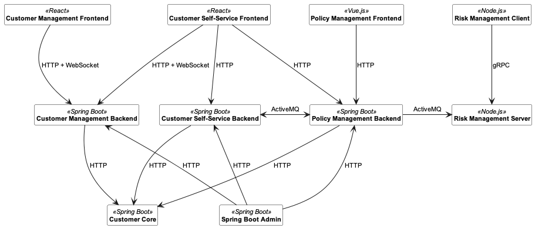

#  Lakeside Mutual

Lakeside Mutual is a fictitious insurance company which serves as a sample application to demonstrate microservices and domain-driven design. The company provides several digital services to its customers and its employees. [Microservice API Patterns (MAP)](https://microservice-api-patterns.org/) are applied in the application backends (see [MAP.md](./MAP.md)).

## Architecture Overview
The following diagram shows an overview of the core components that are the building blocks for the services Lakeside Mutual provides to its customers and its employees:

The following sections contain a short description of each service:

- **[Customer Core](customer-core)**  
  The Customer Core backend is a [Spring Boot](https://projects.spring.io/spring-boot/) application that manages the personal data about
  individual customers. It provides this data to the other backend services through an HTTP resource API.

- **[Customer Self-Service Backend](customer-self-service-backend)**  
  The Customer Self-Service backend is a [Spring Boot](https://projects.spring.io/spring-boot/) application that
  provides an HTTP resource API for the Customer Self-Service frontend. 

- **[Customer Self-Service Frontend](customer-self-service-frontend)**  
  The Customer Self-Service frontend is a [React](https://reactjs.org/) application that allows users to register themselves, view their current insurance policy and change their address.
  
- **[Customer Management Backend](customer-management-backend)**  
  The Customer Management backend is a [Spring Boot](https://projects.spring.io/spring-boot/) application that
  provides an HTTP resource API for the Customer Management frontend and the Customer Self-Service frontend. In addition, [WebSockets](https://developer.mozilla.org/en-US/docs/Web/API/WebSockets_API) are used to implement the chat feature to deliver chat messages in realtime between the callcenter agent using the Customer Management frontend and the Customer logged into the Self-Service frontend.

- **[Customer Management Frontend](customer-management-frontend)**  
  The Customer Management frontend is a [React](https://reactjs.org/) application that allows Customer-Service operators to interact with customers and help them resolve issues related to Lakeside Mutual's insurance products.

- **[Policy Management Backend](policy-management-backend)**  
  The Policy Management backend is a [Spring Boot](https://projects.spring.io/spring-boot/) application that provides an HTTP resource API for the Customer Self-Service frontend and the Policy Management frontend. It also sends a message (via [ActiveMQ](http://activemq.apache.org/) messaging) to the Risk Management Server whenever an insurance policy is created / updated.

- **[Policy Management Frontend](policy-management-frontend)**  
  The Policy Management frontend is a [Vue.js](https://vuejs.org/) application that allows Lakeside Mutual employees to view and manage the insurance policies of individual customers.

- **[Risk Management Server](risk-management-server)**  
  The Risk-Management server is a [Node.js](https://nodejs.org) application that gathers data about customers / policies and can generate a customer data report on demand.

- **[Risk Management Client](risk-management-client)**  
  The Risk-Management client is a command-line tool built with [Node.js](https://nodejs.org). It allows the
  professionals of Lakeside Mutual to periodically download a customer data report which helps them during risk assessment.

- **[Eureka Server](eureka-server)**  
  [Eureka Server](https://spring.io/guides/gs/service-registration-and-discovery/#initial) provides a service registry. It is a regular Spring Boot application to which all other Spring services can connect to access other services. For example, the Customer Self-Service Backend uses Eureka to connect to the Customer Core. Usage of Eureka is optional.

- **[Spring Boot Admin](spring-boot-admin)**  
  [Spring Boot Admin](https://github.com/codecentric/spring-boot-admin) is an open source software for managing and monitoring Spring Boot applications. It *is* a Spring Boot application too. Usage within the Lakeside Mutual services is optional and only included for convenience with all security disabled.
  
The backends use Domain-Driven Design (DDD) to structure their domain (business) logic and their service-internal logical layers. To do so, they use marker interfaces defined in this [Domain-Driven Design Library](https://github.com/Microservice-API-Patterns/DDD-Library).

To learn more about individual components, please have a look at the README file in the corresponding subfolder.

## Getting started 

Detailed setup instructions can be found in each application's README file. To conveniently start all applications, the `run_all_applications` scripts can be used. Alternatively, to start a minimal subset of applications, i.e., the Customer Management Applications and the Customer Core, use the `run_customer_management_applications` script.

1. Make sure you have [Java 8 or higher](https://adoptium.net/) installed.
1. Install [Node](https://nodejs.org/en/). Version 12 or later is required. You can check the currently installed version by running `node --version`.
1. Install Python. We don't use Python ourselves, but some Node.js packages require native addons that are built using node-gyp, which requires Python. See the [node-gyp README for details on which Python version to install](https://github.com/nodejs/node-gyp#on-unix).
1. Install Maven (see [https://maven.apache.org](https://maven.apache.org) for installation instructions).
1. Run the `run_all_applications` script suitable for your platform. Note that the frontend applications might be running before the backends are ready. In that case, just reload the page in the browser.

If the script exits, one of the applications could not be started. For troubleshooting, we recommend to start the applications individually. Note that you don't need to start all applications. The overview diagram above can be used to figure out the dependencies of each service. 

The following table lists all the ports that have to be free for each component to work correctly. If you need to change any of these ports, please
consult the README of the corresponding component:

| Component  | Ports |
| ---------- | ----- |
| [Customer Self-Service Backend](customer-self-service-backend) | 8080 (HTTP resource API) |
| [Policy Management Backend](policy-management-backend) | 8090 (HTTP resource API) 61613 (ActiveMQ broker) 61616 (ActiveMQ broker) |
| [Customer Management Backend](customer-management-backend) | 8100 (HTTP resource API) |
| [Customer Core](customer-core) | 8110 (HTTP resource API) |
| [Customer Self-Service Frontend](customer-self-service-frontend) | 3000 (Web server) |
| [Policy Management Frontend](policy-management-frontend) | 3010 (Web server) |
| [Customer Management Frontend](customer-management-frontend) | 3020 (Web server) |
| [Risk Management Server](risk-management-server) | 50051 (gRPC server) |
| [Risk Management Client](risk-management-client) | - (CLI Client) |
| [Eureka Server](eureka-server) | 8761 (Admin web frontend) |
| [Spring Boot Admin](spring-boot-admin) | 9000 (Web server) |

## Docker

All projects come with Dockerfiles that can be used to run the services as Docker containers. The [docker-compose.yml](./docker-compose.yml) builds and starts all applications in a single command. See the [docker-compose.yml](./docker-compose.yml) for more information. Note that building the images takes some time (without caches, our most recent build took 6 minutes on a development machine).

## Data Stores

Each backend service has its own data store. The Spring-JPA based applications all use the H2 relational database. By default, all data will be lost during restarts, please see the individual README files to enable durable persistency. The backend services also contain the H2 Console to browse the database. It can be found at `/console`. For example, for the Customer Core, the address is [http://localhost:8110/console](http://localhost:8110/console).

## Frequently Asked Questions and Troubleshooting

See our [FAQ](./FAQ.md) for more information on running the applications and the [IDE instructions](./IDE_INSTRUCTIONS) page to get started with IntelliJ IDEA, Eclipse and Visual Studio Code.

## License

This project is made available under the Eclipse Public License v 2.0. See the [LICENSE](LICENSE.md) file for the full license.
